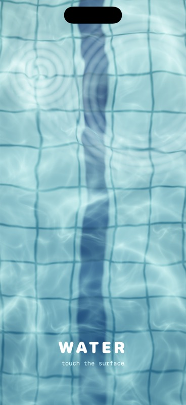
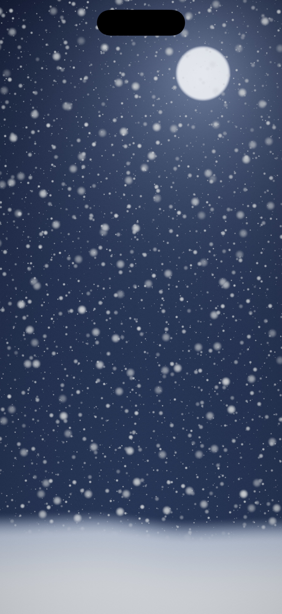
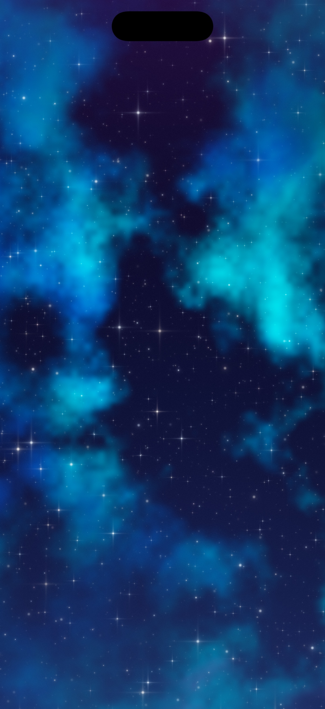
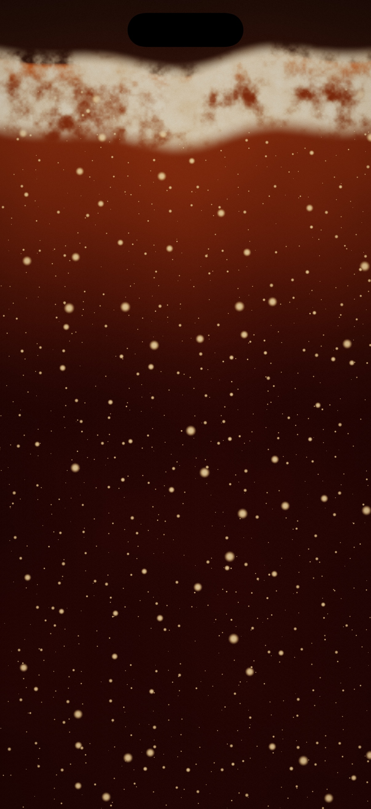

# metal-experiments ⚡️

Small, self-contained visual experiments for iOS. Every effect lives in its own folder:

```
<effect>/
├── README.md        # what it is + how to drop it into your app
├── screenshot.jpg   # preview
├── demo.mp4         # short capture
├── project.yml      # xcodegen spec for the standalone demo app
└── Sources/         # the effect code
```

## Effects

| Preview | Effect | Description |
|---|---|---|
| <a href="singularity/"></a> | [**Singularity**](singularity/) | A procedural black-hole nebula: gravitational swirl + domain-warped fbm noise + event-horizon rim. Drag to bend spacetime. One `colorEffect` shader, iOS 17+. |
| <a href="water/"></a> | [**Water**](water/) | A sunlit pool: waves refract the tile floor, caustics dance on top, raindrops ring the surface, and touching it sends out ripples. One `colorEffect` shader, iOS 17+. |
| <a href="martian-sand/"></a> | [**Martian Sand**](martian-sand/) | A Martian dune field: raking sun on wind-rippled sand, gusty dust streaming over the dunes, and a dust devil that swirls the sand where you touch. One `colorEffect` shader, iOS 17+. |
| <a href="snow/"></a> | [**Snow**](snow/) | A winter night: a moon in a cold sky, parallax layers of snow drifting down on a gusting wind, a snow bank below, and a flurry that swirls up where you touch. One `colorEffect` shader, iOS 17+. |
| <a href="night-sky/"></a> | [**Night Sky**](night-sky/) | A vivid deep-space sky: a tilted Milky Way of multi-hue nebula and dust lanes, parallax layers of twinkling coloured stars, the odd shooting star, and a wish-upon-a-star glow where you touch. One `colorEffect` shader, iOS 17+. |
| <a href="coca-cola/"></a> | [**Coca-Cola**](coca-cola/) | A glass of Coca-Cola filling the space: dark caramel cola rises from below, streams of carbonation wobble up through it, a fizzing tan foam head builds on top, and touching it bulges the surface and blows up a burst of fizz. One `colorEffect` shader, iOS 17+. |

## Running a demo

Each folder is a standalone iOS app:

```sh
brew install xcodegen
cd <effect>
xcodegen generate
open *.xcodeproj      # pick a simulator, hit Run
```
