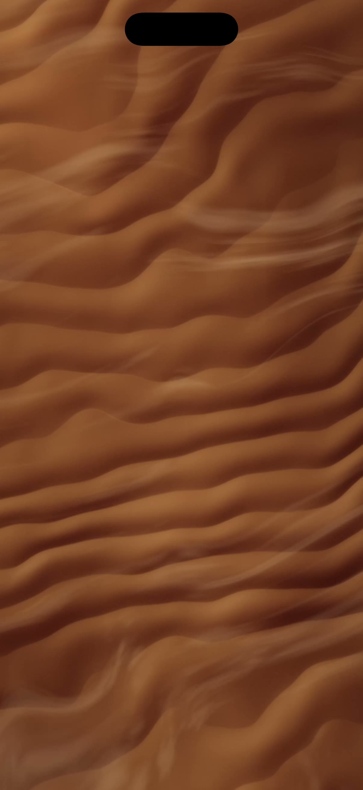

# Martian Sand 🔴

A Martian dune field rendered by **one SwiftUI modifier** and **one Metal shader**.
A low sun rakes across wind-rippled sand, gusty dust streams over the dunes in
wandering directions, and touching the ground spins up a dust devil that swirls
the sand under your finger.



## How it works

- `Sources/MartianSand.metal` — a single `[[stitchable]]` function: dust-devil
  swirl → fbm dune heightfield with meandering wind ripples → raking-sun
  normal shading → gusty dust streaks → grain + tonemap.
- `Sources/MartianSandApp.swift` — `TimelineView(.animation)` feeds time into
  `.colorEffect(ShaderLibrary.martianSand(...))`; a `DragGesture` feeds the touch point.

## Drop into your own app

1. Copy `MartianSand.metal` into your target (Xcode compiles it automatically).
2. Use the shader on any view:

```swift
TimelineView(.animation) { tl in
    Rectangle().colorEffect(ShaderLibrary.martianSand(
        .float2(size), .float(t), .float2(touch), .float(1)
    ))
}
```

Requires iOS 17+ (SwiftUI Shader API).

## Run this demo

```sh
xcodegen generate   # brew install xcodegen
open MartianSand.xcodeproj
```
