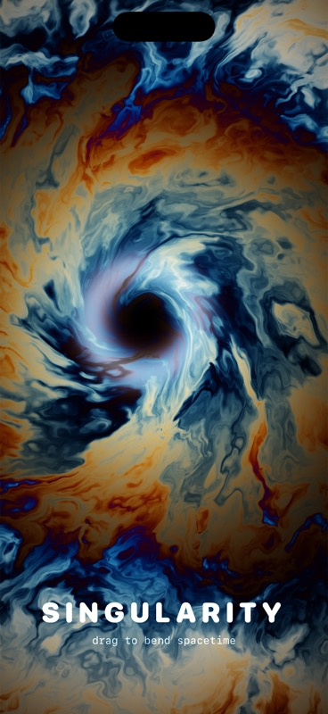

# Singularity ⚫️

A procedural "black hole nebula" rendered by **one SwiftUI modifier** and **one Metal shader**.
No SpriteKit, no MTKView, no render loop code — just `colorEffect` + `TimelineView`.

Drag anywhere to bend spacetime: the vortex follows your finger, the swirl tightens,
and the colors chromatically split around the event horizon.



## How it works

- `Sources/Singularity.metal` — a single `[[stitchable]]` function: gravitational
  swirl → domain-warped fbm noise → neon cosine palette → event-horizon rim → tonemap.
- `Sources/SingularityApp.swift` — `TimelineView(.animation)` feeds time into
  `.colorEffect(ShaderLibrary.singularity(...))`; a `DragGesture` feeds the touch point.

## Drop into your own app

1. Copy `Singularity.metal` into your target (Xcode compiles it automatically).
2. Use the shader on any view:

```swift
TimelineView(.animation) { tl in
    Rectangle().colorEffect(ShaderLibrary.singularity(
        .float2(size), .float(t), .float2(touch), .float(1)
    ))
}
```

Requires iOS 17+ (SwiftUI Shader API). Runs at 60/120 fps — it's one fragment shader.

## Run this demo

```sh
xcodegen generate   # brew install xcodegen
open Singularity.xcodeproj
```
